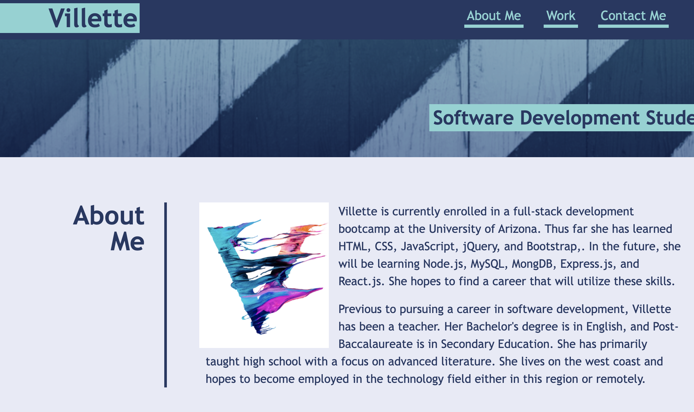

# Villette Comfort Portfolio

## Website Description

A portfolio website that gives samples of my, Villette Comfort's, coding abilities through various projects.

## Challenge Description

This project encompassed creating a website without starter code.  The portfolio includes spaces to showcase samples of work along with a short biography and contact links. There is a responsive layout with a grid that has the first project as the largest shown. Internal links bring the user to designated sections and external links navigate to completed projects. 

## User Story

```
AS AN employer
I WANT to view a potential employee's deployed portfolio of work samples
SO THAT I can review samples of their work and assess whether they're a good candidate for an open position
```

## Acceptance Criteria 

```
GIVEN I need to sample a potential employee's previous work
WHEN I load their portfolio
THEN I am presented with the developer's name, a recent photo or avatar, and links to sections about them, their work, and how to contact them
WHEN I click one of the links in the navigation
THEN the UI scrolls to the corresponding section
WHEN I click on the link to the section about their work
THEN the UI scrolls to a section with titled images of the developer's applications
WHEN I am presented with the developer's first application
THEN that application's image should be larger in size than the others
WHEN I click on the images of the applications
THEN I am taken to that deployed application
WHEN I resize the page or view the site on various screens and devices
THEN I am presented with a responsive layout that adapts to my viewport
```

## Tasks Completed
The HTML document includes:
* a proper title and SEO metadata
* proper HTML semantic labelling
* alt attributes of images for accessibility
* photo, about me, work samples, and contact information
* internal links that scroll to corresponding sections
* external links to projects
* placeholders for future projects
* comments

The CSS document includes:
* an organized structure that matches the HTML order
* variables for repetitive values
* flex and media queries for a responsive layout
* a grid with the first project the largest size
* comments


## Languages
- HTML
- CSS

## Links
* [Deployed webpage](https://villettec.github.io/M2C-Villette_Comfort_Portfolio/)

* [Repository](https://github.com/villettec/M2C-Villette_Comfort_Portfolio/)

## Screenshot


## Credit
Villette Comfort

villette@live.com

